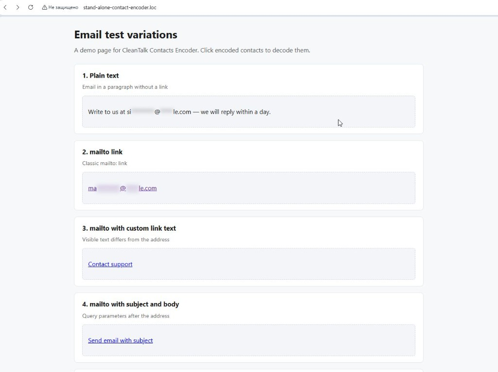

# Contacts Encoder - Quick Start Guide

## Overview

The Contacts Encoder protects email addresses and phone numbers from spam bots. It requires **4 essential components** to work properly:

1. PHP backend with encoder configuration
2. Server-side encoding of HTML content
3. Frontend CSS/JS assets
4. AJAX decode endpoint

Since **2.0.19**, decode requests are validated via built-in `checkRequest()` → `Cleantalk::checkBot()` (`cleantalk/antispam` is installed automatically as a dependency).



*Example: a stand-alone demo page with multiple email encoding scenarios. Click an obfuscated contact to decode it.*

## Requirements

- PHP 7.4+ (OpenSSL recommended for encryption)
- Composer
- A valid CleanTalk access key (`api_key`)

## Installation

```bash
composer require cleantalk/contacts-encoder
```

This also installs `cleantalk/antispam` (^1.6) for bot validation on decode.

## Complete setup in 4 steps

### Step 1: PHP backend setup

#### 1.1 Configure parameters

```php
use Cleantalk\Common\ContactsEncoder\Dto\Params;

$params = new Params();
$params->api_key = 'your_cleantalk_api_key'; // REQUIRED for encryption and checkBot
$params->obfuscation_mode = Params::OBFUSCATION_MODE_BLUR;
$params->do_encode_emails = true;
$params->do_encode_phones = true;
$params->is_logged_in = false; // true skips checkBot for logged-in users
```

#### 1.2 Optional: platform-specific class

Extend `ContactsEncoder` only when you need custom UI text. Built-in `checkRequest()` is used by default since 2.0.19.

```php
use Cleantalk\Common\ContactsEncoder\ContactsEncoder;
use Cleantalk\Common\ContactsEncoder\Dto\Params;

class YourPlatformContactsEncoder extends ContactsEncoder
{
    public static function createParams(): Params
    {
        $params = new Params();
        $params->api_key = 'your_cleantalk_api_key';
        $params->obfuscation_mode = Params::OBFUSCATION_MODE_BLUR;
        $params->do_encode_emails = true;
        $params->do_encode_phones = false;
        $params->is_logged_in = false;

        return $params;
    }

    protected function getTooltip()
    {
        return 'Click to decode protected contact';
    }
}
```

Override `checkRequest()` only if you need custom validation instead of the default `checkBot` flow.

### Step 2: Encoding content

```php
$encoder = ContactsEncoder::getInstance($params);
// or: YourPlatformContactsEncoder::getInstance(YourPlatformContactsEncoder::createParams());

$protectedHtml = $encoder->runEncoding($yourHtmlContent);

echo $protectedHtml;
```

### Step 3: Frontend assets

Include assets from `vendor/cleantalk/contacts-encoder/assets/` at the end of `<body>`:

```html
<link rel="stylesheet" href="/path/to/contacts_encoder.css">
<script src="/path/to/contacts_encoder.js"></script>
```

### Step 4: JavaScript configuration

#### 4.1 Create config object

```javascript
const encoderConfig = {
    decodeContactsRequest: (encodedNodes) => {
        return fetch('/your-ajax-endpoint', {
            method: 'POST',
            body: encodedNodes,
        }).then((response) => response.json());
    },

    texts: {
        waitForDecoding: 'Decoding contact...',
        decodingProcess: 'Please wait',
        gotIt: 'Got it',
        clickToSelect: 'Click to select the email',
        originalContactsData: 'Full address:',
        blocked: 'Access denied',
    },

    serviceData: {
        brandName: 'Your Site Name',
    },
};
```

#### 4.2 Initialize on frontend

```javascript
new ContactsEncoder(encoderConfig);
```

**Important:** do **not** wrap `new ContactsEncoder()` in `DOMContentLoaded`. The library registers its own `DOMContentLoaded` listener internally. If you create the instance inside another `DOMContentLoaded` handler, click handlers may never attach.

Load scripts at the end of `<body>`.

## Decode endpoint

Create an AJAX endpoint that calls `runDecoding()`:

```php
<?php

require 'vendor/autoload.php';

header('Content-Type: application/json; charset=utf-8');

$payload = json_decode(file_get_contents('php://input'), true);

if (!is_array($payload)) {
    echo json_encode(['success' => false, 'data' => []]);
    exit;
}

// Optional: forward bot-check fields to checkRequest()
if (!empty($payload['event_token'])) {
    $_POST['event_token'] = (string) $payload['event_token'];
}
if (!empty($payload['event_javascript_data'])) {
    $_POST['event_javascript_data'] = (string) $payload['event_javascript_data'];
}

$encoder = ContactsEncoder::getInstance($params);
echo $encoder->runDecoding($payload);
```

### Request format

JSON body with encoded nodes:

```json
{
  "0": "encoded_string_1",
  "1": "encoded_string_2"
}
```

Optional fields for production bot checks:

```json
{
  "event_token": "hash_from_cleantalk_js",
  "0": "encoded_string"
}
```

### Response format

```json
{
  "success": true,
  "data": [
    {
      "is_allowed": true,
      "show_comment": false,
      "comment": "Allowed",
      "encoded_email": "...",
      "decoded_email": "user@example.com"
    }
  ]
}
```

## How decoding works

```
User click on encoded contact
    → contacts_encoder.js (fetch decode endpoint)
    → runDecoding()
    → checkRequest() → Cleantalk::checkBot() (event_type: CONTACT_DECODING)
    → JSON response
    → popup with decoded contact
```

If the CleanTalk API returns a connection error, decoding is still allowed and the error is returned in `comment`.

## Troubleshooting

| Problem | Likely cause |
|---------|----------------|
| Email is blurred but click does nothing | `ContactsEncoder` created inside `DOMContentLoaded` — remove the wrapper |
| Decode returns empty / error | Wrong `api_key`, or JSON body format mismatch |
| `checkBot` always allows | API connection error — library allows decode on API failure |
| Click on text around email ignored | Only `<span class="apbct-email-encoder">` is clickable |

## Development

```bash
composer install
composer test
```

## Links

- [contacts-encoder on GitHub](https://github.com/CleanTalk/contacts-encoder)
- [cleantalk/antispam on Packagist](https://packagist.org/packages/cleantalk/antispam)
- [CleanTalk](https://cleantalk.org/)
